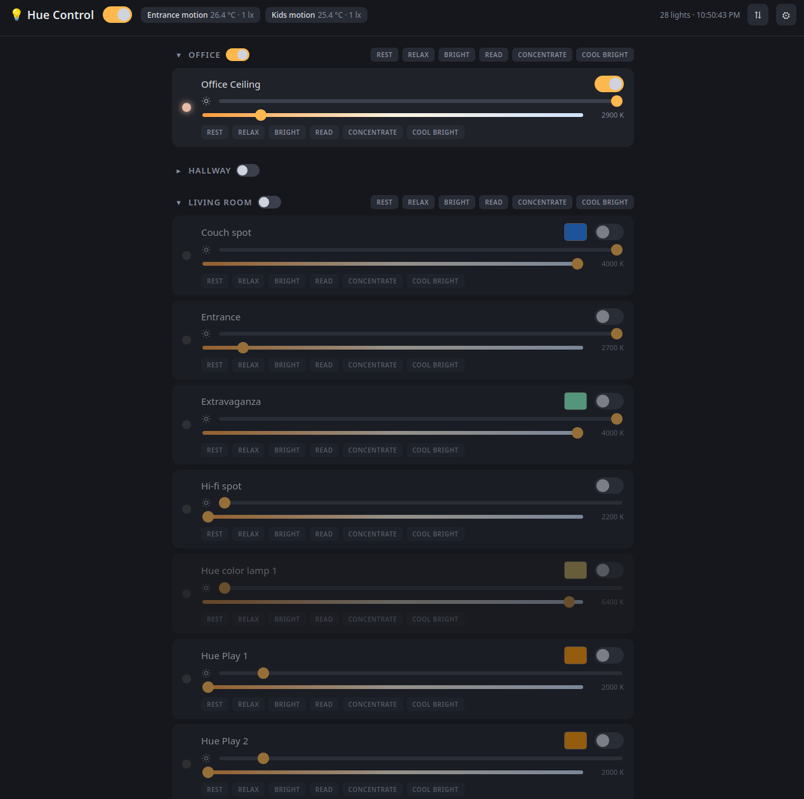

# HUE Lights WebUI

A zero-dependency, single-file web UI for Philips Hue. One `index.html`,
plain HTML/CSS/JS, no build step, no frameworks — talks directly to the Hue
bridge REST API on your local network. The prompts that built it are logged
in [PROMPT_LOG.md](PROMPT_LOG.md).

Hosted version (GitHub Pages): **<http://hueui.srm.gr>** — plain HTTP only.
It does **not** work over HTTPS: the browser would block requests from an
HTTPS page to the bridge's HTTP API as mixed content.



## Features

- **Pairing** — set the bridge IP, press the bridge link button and pair, or
  paste an existing app key (useful on a new browser). Key and IP are stored
  in `localStorage`; the key can be viewed/copied/replaced and the IP changed
  from the settings panel (⚙).
- **Lights by room** — lights grouped by the bridge's rooms; unassigned
  lights appear under *Other*. Live state refresh every 5 seconds.
- **Per light**: on/off toggle, brightness slider, HTML5 color picker for
  color lamps, kelvin slider (100 K steps, live readout) for white — on both
  ambiance and color lamps.
- **White presets** — Rest, Relax, Bright, Read, Concentrate, Cool bright
  (ordered warm → cool) on every white-capable lamp and on each room.
- **Per-room toggles** and a **master switch** next to the title that flips
  every light on the bridge.
- **Sensor readings** — temperature (°C) and ambient light (lux) from Hue
  motion sensors, shown in the header.
- **Reorder & rename** (⇅) — arrange rooms and lights with arrow buttons
  (order saved per browser), rename them with ✏ (saved on the bridge, so
  all Hue apps see the new names).

## Usage

1. Open `index.html` in a browser. Recent bridge firmware sends CORS
   headers, so `file://` works directly. If your browser refuses:

   ```bash
   python3 -m http.server
   # then open http://localhost:8000
   ```

2. Enter your bridge IP, press the link button on the bridge and click
   **Pair with Bridge** — or paste an app key you already have.

## Notes

- Uses the Hue bridge **v1 API** (`/api/...`). No cloud, nothing leaves your
  LAN.
- Custom room/light order lives in this browser's `localStorage`; renames
  are written to the bridge itself.

## License

[MIT](LICENSE)

## Why?
Because I wanted something like this for years and never had the time to make it.
Every other option was fragile, dependency heave, deprecated, abandoned etc.

## How?
Anthropic Fable day one and me wanting to see what it's capable off.
